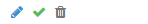
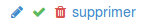
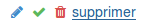

# Confirmation Link

CSS-only mechanism to require a confirmation before allowing an action.

**N.B. :** current template is a `Django` template.
# Preview

 ← default
 ← clicked
 ← require corfirmation

# Usage

## Django
```python



```