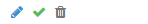
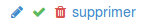
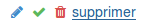

# Confirmation Link

CSS-only mechanism to require a confirmation before allowing an action.

Currently only available as a `Django` template.

## Requirements

* (optional) [Bootstrap](http://getbootstrap.com/) `≥3` ;

## Preview

 ← default
 ← clicked
 ← require corfirmation

## Usage

1. Import the `SCSS` in your main stylesheet: 

        @import "confirm-link";

2. add the `HTML` code from [./_confirm-link.html](./_confirm-link.html) to your form ;

    ```python
    
    
    
    ```